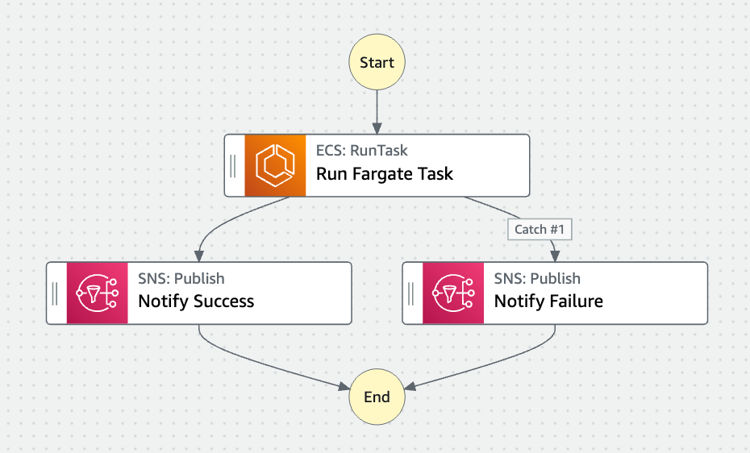
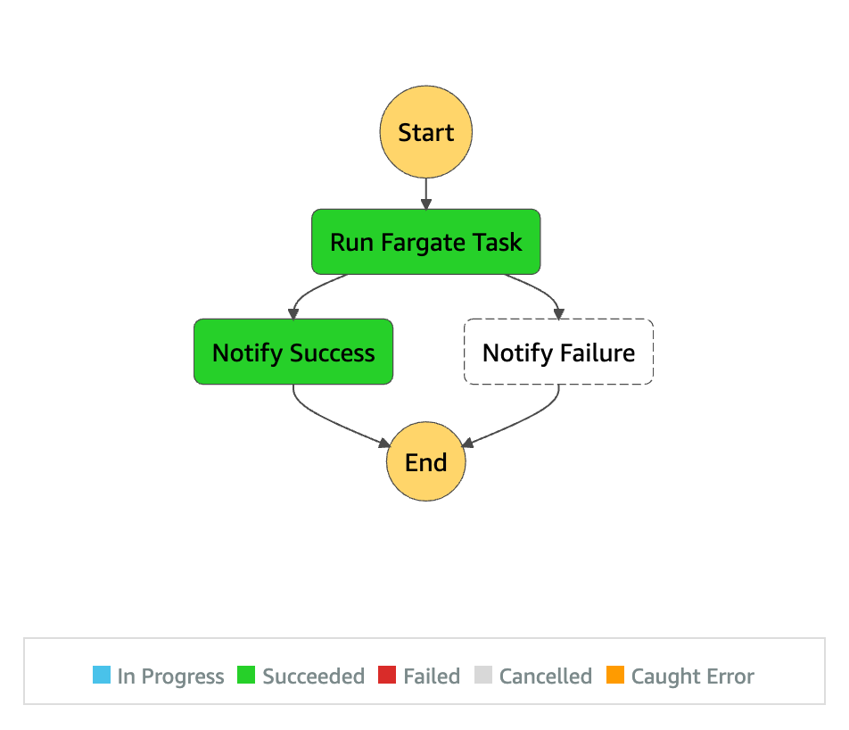

# Resilient Scheduled Fargate tasks

## Overview by Step Functions Workflow Studio



## What is the difference between this sample and the _normal_ scheduled Fargate tasks?

There are [_normal_ scheduled tasks](https://docs.aws.amazon.com/AmazonECS/latest/developerguide/scheduled_tasks.html) in Amazon ECS/Fargate which use the [Amazon EventBridge's Cron feature](https://docs.aws.amazon.com/eventbridge/latest/userguide/eb-create-rule-schedule.html) to invoke Fargate tasks periodically. While this is good enough for simple use cases, we often need to handle task errors to recover the failures by retrying automatically.

In this example, we also use EventBridge cron rules but do not invoke Fargate tasks directly from within EventBridge. Instead, it starts Step Functions state machine to invoke Fargate tasks to use the "Retry" feature in Step Functions to handle application errors and failures in Fargate task, or errors happened in Amazon ECS.

Here is the except of the state machine JSON defined in the CloudFormation template. The `ECS.AmazonECSException` error is caused by Amazon ECS in the case of API throttling for calling ECS RunTask API for example. The `States.TaskFailed` error is more generic one defined by Step Functions and it catches everything other than `States.Timeout` error. See the [Step Functions documentation](https://docs.aws.amazon.com/step-functions/latest/dg/concepts-error-handling.html) for further details.

```json
...
{
    ...
    "Retry": [
        {
            "ErrorEquals": [
                "ECS.AmazonECSException"
            ],
            "IntervalSeconds": 10,
            "MaxAttempts": 3,
            "BackoffRate": 2.0
        },
        {
            "ErrorEquals": [
                "States.TaskFailed"
            ],
            "IntervalSeconds": 3,
            "MaxAttempts": 3,
            "BackoffRate": 1.0
        }
    ],
    ...
}
```

## Set up

Use the [CloudFormation template](./template.yml) to provision resources.

## Run State Machine

Just run the provisioned state machine.

## Execution Result


