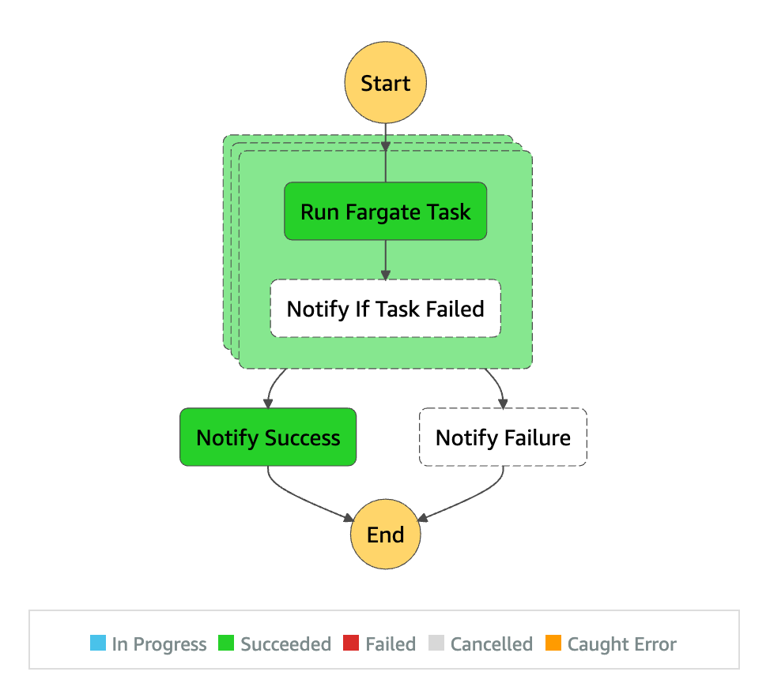

# Parallelized Fargate tasks with Step Functions "Map"

## Overview by Step Functions Workflow Studio

## What you can do with this example

You can run parameterized & parallelized Fargate tasks using the Step Functions "[Map](https://docs.aws.amazon.com/step-functions/latest/dg/amazon-states-language-map-state.html)" state.

## Set up

Use the [CloudFormation template](./template.yml) to provision resources.

## Run State Machine

Use the [test data](./test-data.json) to test.

## Execution Result

