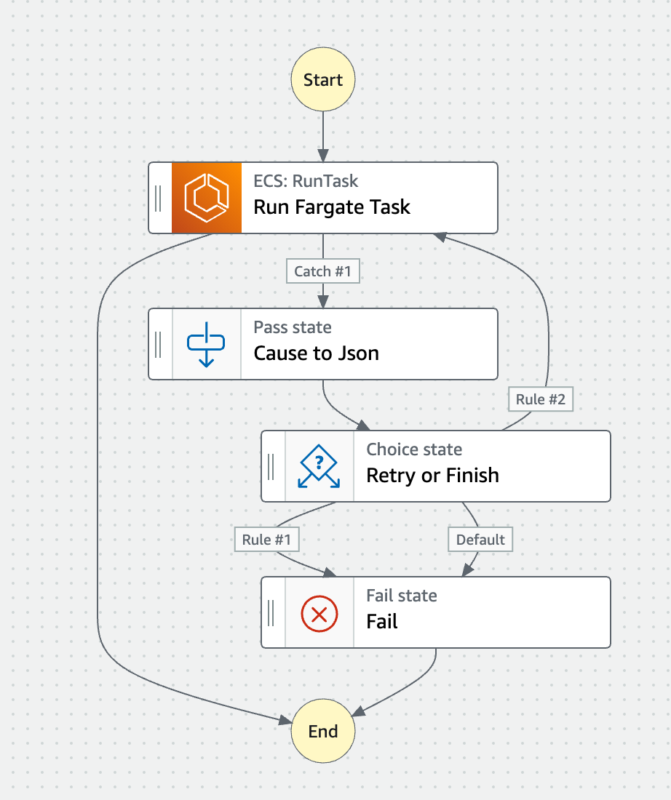
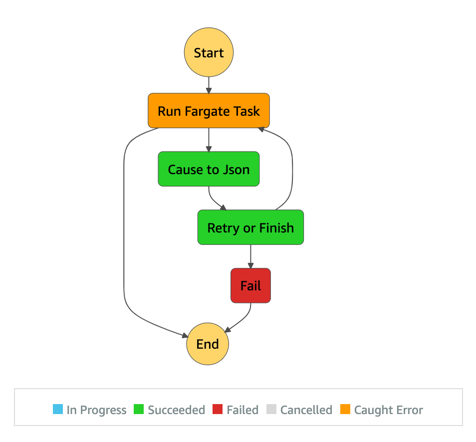

# Parallelized Fargate tasks with Step Functions "Map"

## Overview by Step Functions Workflow Studio

## What you can do with this example

You can decide to or not to retry based on the specific error codes recorded in the "[stoppedReason](https://docs.aws.amazon.com/AmazonECS/latest/developerguide/stopped-task-errors.html)" field which is produced from Fargate tasks.

For example, you can do "Retry when the error is `ResourceInitializationError`, but do not retry and just fail when the error is `CannotPullContainerError`". See the full list of the error codes in the [Amazon ECS documentation](https://docs.aws.amazon.com/AmazonECS/latest/userguide/stopped-task-error-codes.html).

## FAQ

Q: What are the Pros/Cons comparing to using the "Retry" field (which is used in [another example](../1-resilient-scheduled-fargate-tasks))?

### Pros

This example can retry only on specific errors in the "[stoppedReason](https://docs.aws.amazon.com/AmazonECS/latest/developerguide/stopped-task-errors.html)" field of the ECS task result. e.g. "[ResourceInitializationError](https://docs.aws.amazon.com/AmazonECS/latest/userguide/stopped-task-error-codes.html)"

### Cons

This example does not use the "[Retry](https://docs.aws.amazon.com/step-functions/latest/dg/concepts-error-handling.html#error-handling-retrying-after-an-error)" field of the "[Task](https://docs.aws.amazon.com/step-functions/latest/dg/amazon-states-language-task-state.html)" state. Thus,

- You may need to implement an "Exponential back-off" logic somehow
- You may need to implement to limit the maximum number of retries (this is the reason we're using the "[TimeoutSeconds](https://docs.aws.amazon.com/step-functions/latest/dg/amazon-states-language-state-machine-structure.html)" field in the top-level of the state machine - [here](./template.yml#L56) and [here](./template.yml#L65).

## Set up

Use the [CloudFormation template](./template.yml) to provision resources.

## Run State Machine

Just run the state machine, then it always fails. Because the ECS task definition uses a non-existing container image name intentionally.

## Execution Result

