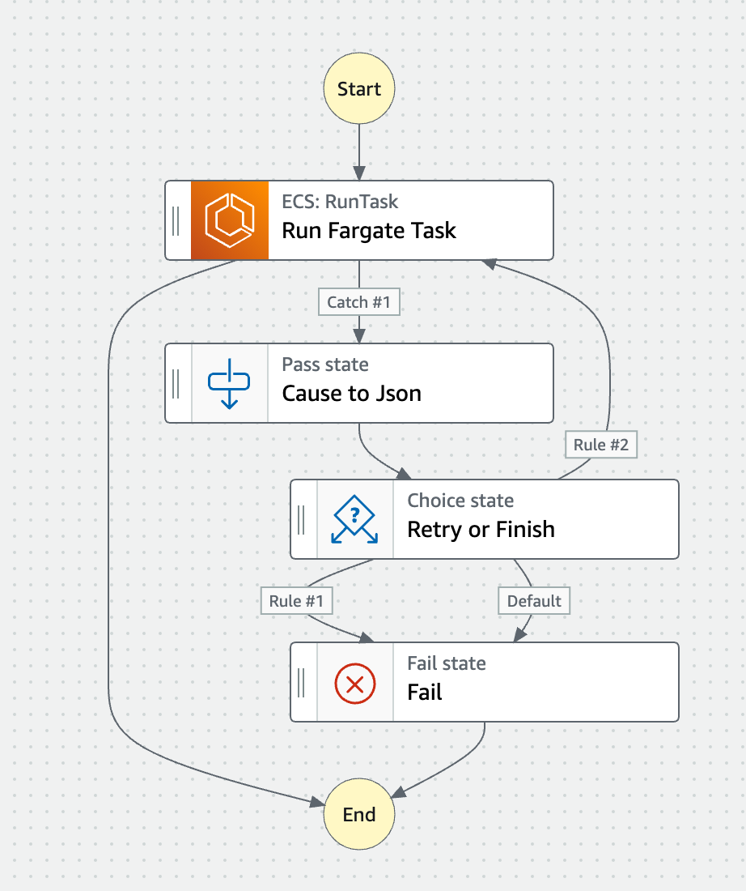

# AWS Fargate with Step Functions

Patterns for resilient AWS Fargate task execution with AWS Step Functions.

## 1. Resilient Scheduled Fargate Tasks

This example shows you how to make scheduled Fargate tasks resilient by using the Step Functions' "Retry" feature.

## 2. Parallerized Fargate Tasks

This example shows you how to run parameterized and parallerized Fargate tasks by using the Step Functions' "Map" state.

## 3. Granular Error Handling based on Fargate Task's "stoppedReason"s

This example shows you how to handle errors based on the "[stoppedReason](https://docs.aws.amazon.com/AmazonECS/latest/developerguide/stopped-task-errors.html)" field of ECS task result.

You can do "Retry when the error is `ResourceInitializationError`, but do not retry and just fail when the error is `CannotPullContainerError`", for example. See the full list of the error codes in the [Amazon ECS documentation](https://docs.aws.amazon.com/AmazonECS/latest/userguide/stopped-task-error-codes.html).

## Contribution

1. Fork ([https://github.com/toricls/aws-fargate-with-step-functions/fork](https://github.com/toricls/aws-fargate-with-step-functions/fork))
1. Create a feature branch
1. Commit your changes
1. Rebase your local changes against the main branch
1. Create a new Pull Request

## Licence

[MIT](LICENSE)

## Author

[Tori Hara](https://github.com/toricls)
